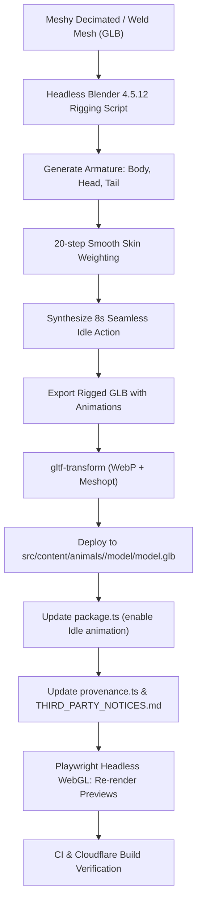

# Design Spec: Procedural Rigging and Idle Animation for Animals 19-26

- **Date**: 2026-09-16
- **Status**: Approved
- **Target Animals**: 19 (`velociraptor`), 20 (`parasaurolophus`), 21 (`dunkleosteus`), 22 (`ammonite`), 23 (`jaekelopterus`), 24 (`smilodon`), 25 (`spinosaurus`), 26 (`corythosaurus`)

---

## 1. Background & Problem

Prehistoric animals 19 through 26 were regenerated using the Meshy-6 PBR workflow, producing static meshes without skeletons or animation clips. Consequently, their exhibits in the Prehistoric Animal Museum render as completely motionless models, unlike animals 1 through 18 which feature lifelike breathing and posture sway animations.

This specification details the procedural pipeline to rig these 8 models, synthesize an 8-second seamless `Idle` animation clip, optimize the resulting GLBs to project standards, update package and provenance metadata, and verify production boundaries.

---

## 2. Architecture & Components



### 2.1 Armature Bones & Anatomy Alignment
Each animal's geometry is oriented with the front/skull toward Blender +Y and grounded/centered on Z:
- **`Body` (Root)**: Origin at ground center $(0, 0, 0)$, head at $(0, 0, \text{height} \times 0.72)$. Serves as the breathing and posture root.
- **`Head`**: Extends forward along $+Y$ from the blend start zone ($\approx 69\%$ of body span) to the anterior tip.
- **`Tail`**: Extends backward along $-Y$ from the posterior blend zone ($\approx 30\%$ of body span) to the caudal tip.

### 2.2 Smooth Skin Weighting
Vertices along the animal length ($Y$-axis) are partitioned into smooth blend buckets:
- Anterior vertices ($Y \ge \text{head\_full\_start}$): $100\%$ `Head` bone.
- Anterior transition zone: 20-step linear/smooth interpolation between `Body` and `Head`.
- Posterior vertices ($Y \le \text{tail\_full\_start}$): $100\%$ `Tail` bone.
- Posterior transition zone: 20-step interpolation between `Body` and `Tail`.
- Midsection/torso: $100\%$ grounded `Body` bone.

### 2.3 Synthesized 8-second Seamless `Idle` Action
- Frame rate: $24\text{ fps}$, frames $0 \dots 192$ ($8.0\text{ s}$).
- **Breathing**: `Body` bone scales sinusoidally across two cycles:
  - Width ($X$): $\pm 1.8\%$
  - Height ($Z$): $\pm 1.2\%$
  - Length ($Y$): $\pm 0.4\%$
- **Head Look/Sway**: `Head` bone applies composite quaternion rotations:
  - Yaw/look: $\pm 5.5^\circ$ (1 cycle)
  - Pitch/nod: $\pm 2.0^\circ$ (2 cycles)
- **Tail/Fin Wave**: `Tail` bone applies composite quaternion rotations:
  - Horizontal wave: $\pm 7.0^\circ$ (3 cycles)
  - Vertical lift: $\pm 1.5^\circ$ (1 cycle)
- Frame 192 matches Frame 0 with zero drift, producing a seamless infinite loop.

---

## 3. Production Delivery & Packaging

### 3.1 Optimization Targets
- **Triangle budget**: $\le 100,000$ triangles (hard ceiling: $250,000$).
- **File size budget**: $\le 12\text{ MB}$ (hard ceiling: $20\text{ MB}$).
- **Compression**: WebP texture maps + Meshopt quantized attributes and animation keyframe tracks.

### 3.2 Metadata Configuration
- `src/content/animals/<id>/package.ts`:
  ```ts
  animation: {
    clip: 'Idle',
    loop: 'repeat',
    speed: 0.8,
  },
  ```
- `src/content/animals/<id>/provenance.ts`:
  - Calculate SHA-256 and byte count of newly generated `model.glb`.
  - Update `runtime.sha256` and `runtime.bytes`.
- Run `npm run generate:credits` to regenerate `THIRD_PARTY_NOTICES.md`.
- Run `tsx scripts/render-model-previews.ts --target=production` to update `model-preview.manifest.json` and 6 WebP previews per animal.

---

## 4. Verification Plan

1. **Content & Preview Validation**:
   - `npm run validate:content`: Verify all package definitions and provenance metadata match runtime assets.
   - `npm run validate:model-previews`: Verify all 26 production animals have matching source model signatures.
2. **Code Integrity**:
   - `npm run lint`
   - `npm run typecheck`
   - `CI=true npx vitest run`
3. **Cloudflare Production Build**:
   - `npm run build:cloudflare`: Ensure production boundary passes and static bundle is compiled with zero errors.
