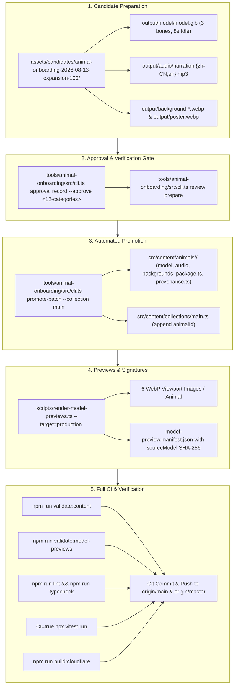

# Design Spec: Expanding Prehistoric Animal Museum to 50 Species

- **Date**: 2026-09-16
- **Status**: Approved
- **Scope**: Onboard 24 new prehistoric species (Animals 27–50) to reach a total of 50 published exhibits.

---

## 1. Background & Goals

The Prehistoric Animal Museum currently exhibits 26 fully animated, interactive prehistoric animals with procedural 3-bone Armatures, 8-second seamless looping `Idle` animations, bilingual (English & Simplified Chinese) audio narration, multi-viewport WebP previews, and production metadata.

This specification defines the phased onboarding of 24 additional prehistoric species into the production catalogue (`mainCollection`), expanding the total museum collection from 26 to 50 exhibits while preserving all production gates, visual standards, and Cloudflare Pages deployment requirements.

---

## 2. Species Allocation & Batching

The 24 new species are curated from the existing candidate repository (`assets/candidates/animal-onboarding-2026-08-13-expansion-100/`) and divided into 4 balanced, thematic batches of 6 species each:

### Batch 1 (Animals 27–32): Cross-Era & Habitat Diversity
- **27. `allosaurus` (异特龙)**: Jurassic apex predator (Land / Dinosaur)
- **28. `brachiosaurus` (腕龙)**: Giant long-necked sauropod (Land / Dinosaur)
- **29. `quetzalcoatlus` (风神翼龙)**: Giant late Cretaceous azhdarchid pterosaur (Air / Pterosaur)
- **30. `elasmosaurus` (薄板龙)**: Extremely long-necked marine plesiosaur (Water / Marine Reptile)
- **31. `megaloceros` (大角鹿)**: Giant Pleistocene deer megafauna (Land / Mammal)
- **32. `anomalocaris` (奇虾)**: Cambrian apex predatory radiodont (Water / Early Arthropod)

### Batch 2 (Animals 33–38): Iconic Predators, Agile Hunters & Synapsids
- **33. `albertosaurus` (阿尔伯塔龙)**: Late Cretaceous tyrannosaurid (Land / Dinosaur)
- **34. `carnotaurus` (食肉牛龙)**: Distinctive horned South American abelisaurid (Land / Dinosaur)
- **35. `ceratosaurus` (角鼻龙)**: Jurassic horned theropod with dorsal osteoderms (Land / Dinosaur)
- **36. `compsognathus` (美颌龙)**: Small, nimble Late Jurassic coelurosaur (Land / Dinosaur)
- **37. `deinonychus` (恐爪龙)**: Cretaceous dromaeosaurid with prominent sickle claws (Land / Dinosaur)
- **38. `dimetrodon` (异齿兽)**: Permian sail-backed synapsid (Land / Synapsid)

### Batch 3 (Animals 39–44): Specialized Niches, Armored Titans & Feathered Wonders
- **39. `baryonyx` (重爪龙)**: Fish-eating spinosaurid with crocodile-like snout (Land / Dinosaur)
- **40. `edmontosaurus` (埃德蒙顿龙)**: Late Cretaceous crest-bearing hadrosaurid (Land / Dinosaur)
- **41. `ankylosaurus` (甲龙)**: Armored herbivorous dinosaur with heavy tail club (Land / Dinosaur)
- **42. `diplodocus` (梁龙)**: Iconic Jurassic sauropod with whip-like tail (Land / Dinosaur)
- **43. `microraptor` (小盗龙)**: Four-winged arboreal feathered dromaeosaurid (Air / Dinosaur)
- **44. `glyptodon` (雕齿兽)**: Armored giant mammal of the Pleistocene (Land / Mammal)

### Batch 4 (Animals 45–50): Apex Predators, Colossal Titanosaurs & Ancient Skies/Seas
- **45. `acrocanthosaurus` (高棘龙)**: High-spined apex predator of Early Cretaceous North America (Land / Dinosaur)
- **46. `carcharodontosaurus` (鲨齿龙)**: Giant North African carcharodontosaurid (Land / Dinosaur)
- **47. `herrerasaurus` (黑瑞拉龙)**: Early carnivorous dinosaur of the Late Triassic (Land / Dinosaur)
- **48. `argentinosaurus` (阿根廷龙)**: Colossal titanosaur sauropod (Land / Dinosaur)
- **49. `anhanguera` (安汉翼龙)**: Toothed fish-hunting Cretaceous pterosaur (Air / Pterosaur)
- **50. `ophthalmosaurus` (大眼鱼龙)**: Deep-diving Jurassic ichthyosaur (Water / Marine Reptile)

---

## 3. Architecture & Promotion Pipeline

### 3.1 3D Model Technical Budget
- **Triangle count**: Target <= 100,000 triangles (Hard ceiling: 250,000).
- **File size**: Target <= 12 MB (Hard ceiling: 20 MB).
- **Skeleton**: 3-bone Armature (`Body`, `Head`, `Tail`), aligned along +Y.
- **Animation clip**: Exactly `'Idle'` (case-sensitive), 24 fps, 192 frames (8.0 seconds), frame 192 identical to frame 0 for seamless looping.
- **Compression**: Meshopt geometry & keyframe compression + WebP texture encoding.

### 3.2 Media & Provenance Technical Standards
- **Narration Audio**:
  - Chinese: `audio/narration.zh-CN.mp3`
  - English: `audio/narration.en.mp3`
  - Format: 48 kHz mono MP3, Qwen3-TTS Serena voice.
- **Visuals**:
  - `backgrounds/landscape.webp` (1920x1080 lossy WebP)
  - `backgrounds/portrait.webp` (1080x1920 lossy WebP)
  - `images/poster.webp` (transparent landscape model cutout)
  - `images/poster-portrait.webp` (transparent portrait model cutout)
  - `images/thumbnail.webp` (exhibit catalog square crop)
- **Model Previews**:
  - 6 viewport WebP images rendered via headless Playwright WebGL: `desktopStandard`, `desktopWide`, `landscapeCompact`, `phonePortraitCompact`, `phonePortraitTall`, `tabletPortrait`.
  - `model-preview.manifest.json` recording exact `sourceModel` byte count and SHA-256 hash.
- **Provenance & Credits**:
  - Strict tracking of model origins, licenses (CC0-1.0, CC-BY-4.0, or CC-BY-NC-SA-4.0), generation tools, and scripts.
  - Automatically synchronized with `THIRD_PARTY_NOTICES.md` and `src/content/credits.generated.ts` via `npm run generate:credits`.

---

## 4. Rollback & Fault Tolerance

- **Atomic Staging**: `promote-batch` captures file snapshots (`main.ts`, `credits.generated.ts`, `THIRD_PARTY_NOTICES.md`, `baseline.json`) before executing. Any promotion failure automatically triggers complete rollback to the initial state.
- **Independent Batch Commits**: Each batch (Batch 1: 27–32, Batch 2: 33–38, Batch 3: 39–44, Batch 4: 45–50) is validated independently and committed as a self-contained unit.
- **Dual Branch Synchronization**: Every batch commit is pushed to both `origin/main` and `origin/master`, ensuring continuous deployment on Cloudflare Pages stays healthy and reproducible.

---

## 5. Verification Plan

Each batch must satisfy all 6 automated verification steps before committing:
1. `npm run validate:content`
2. `npm run validate:model-previews`
3. `npm run lint`
4. `npm run typecheck`
5. `CI=true npx vitest run`
6. `npm run build:cloudflare`
