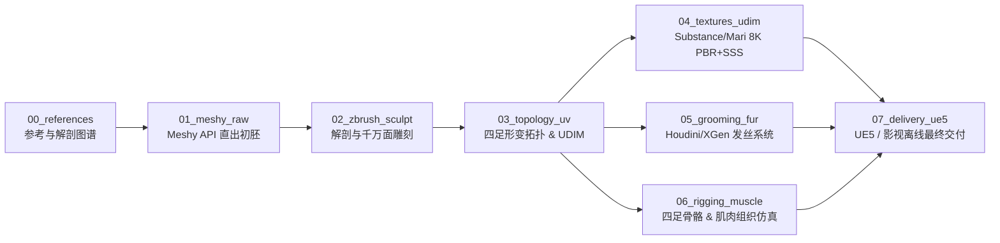

# 工业级动物 3D 建模管线工程规范与 SOP 标准 (AAA / 影视级)

---

## 1. 规范概述与整体架构

本规范旨在将 **Meshy 生成式 3D AI 技术** 深度嵌入到工业级三维生产流程中。Meshy 承担**第 0/1 阶段的白模与体量探索加速（提效 30%~40%）**，后续各阶段严格遵循工业级标准进行解剖重塑、动画级拓扑、发丝级毛发、肌肉动力学及次表面材质制作。

### 1.1 全流程流转图



---

## 2. 标准资产管理目录结构规范

每个动物资产必须建立独立的目录工程，严格遵循阶段命名（00~07）：

```text
assets/animals/<animal_name>_<version>/
├── 00_references/            # 参考资料
│   ├── anatomy/             # 肌肉与骨骼解剖学图谱（骨点、肌肉束）
│   ├── orthographic/        # 严格正视、侧视、顶视无透视照片
│   └── dynamic_locomotion/  # 动态步态、奔跑、扑击慢动作视频/帧序列
├── 01_meshy_raw/             # Meshy AI 直出数据
│   ├── model.glb            # Meshy 导出的原始 GLB 格式
│   ├── model.obj            # Meshy 导出的 OBJ 网格
│   ├── model.fbx            # Meshy 导出的 FBX
│   ├── textures_raw/        # Meshy 生成的基础贴图
│   └── generation_meta.json # 生成所用 prompt、seed、task_id 记录
├── 02_zbrush_sculpt/         # 高精度雕刻工程
│   ├── <animal>_HighPoly.zpr
│   ├── <animal>_AnatomyFix.ztl
│   └── exports/             # 导出用于烘焙的高模（分部位/Decimated）
├── 03_topology_uv/           # 动画拓扑与 UV 展开
│   ├── <animal>_LowPoly.mb  # 拓扑模型（全四边面）
│   ├── <animal>_LowPoly.fbx
│   └── uv_layout/           # UDIM UV 展开图与网格密度（Texel Density）检查
├── 04_textures_udim/         # 贴图与材质工程
│   ├── <animal>_Painter.spp # Substance 3D Painter 工程
│   └── maps_8k_udim/        # 导出的 1001-1004 UDIM 贴图包
│       ├── <animal>_BaseColor.1001.png
│       ├── <animal>_Normal.1001.png
│       ├── <animal>_Displacement.1001.exr (32-bit)
│       ├── <animal>_Roughness.1001.png
│       └── <animal>_SSS_Scatter.1001.png
├── 05_grooming_fur/          # 发丝级毛发系统
│   ├── curves/              # 导向线 Alembic (.abc)
│   ├── houdini/             # Houdini 毛发梳理工程 (.hip)
│   └── ue_groom/            # UE5 Groom 资产配置与绑定材质
├── 06_rigging_muscle/        # 骨骼绑定与肌肉组织
│   ├── skeleton/            # 四足骨骼模板、控制环与 IK/FK 切换
│   ├── muscle_sim/          # Ziva Dynamics 肌肉体解算工程 / ML Deformer
│   └── skin_weights/        # 蒙皮权重备份 (.weight)
└── 07_delivery_ue5/          # 最终引擎交付
    ├── SK_<animal>.uasset   # 骨骼网格体 (Skeletal Mesh)
    ├── MI_<animal>.uasset   # 动态材质实例 (含 SSS 节点)
    ├── Groom_<animal>.uasset# 毛发资产
    └── Anim_<animal>_Walk.uasset # 验收步态动作
```

---

## 3. 分阶段作业细则与质量验收标准 (SOP)

### 阶段 01：Meshy AI 概念初胚生成 (Base Mesh)
* **作业目标**：快速获取三维体积参考与基础形态，严禁耗费大量手工时间从 ZSphere / 几何球起模。
* **参数建议**：
  * 使用 `Text-to-3D v2` 或 `Image-to-3D`；
  * Mode 设定：必须完整执行 `preview` -> `refine` 双阶段；
  * `ai_model`: 选用 `meshy-4` 或最新版本高精模型；
  * 材质输出：开启 `enable_pbr: true`，获取 Normal 与 Roughness。
* **验收标准**：
  - [ ] 整体躯干与四肢长宽比偏差 $\le 5\%$；
  - [ ] 无严重穿模与网格自相交破洞。

### 阶段 02：ZBrush 肌肉解剖重塑 (Anatomy Sculpt)
* **作业目标**：将 AI 模型的“平滑/肉团感”纠正为严格符合动物解剖学的骨肉结构。
* **解剖控制核心**：
  1. **骨性标记（Bone Landmarks）**：肩胛冈、大转子、坐骨结节、跟骨、胸骨脊必须清晰可触。
  2. **四足特有肌群**：
     - 前肢：冈下肌、三角肌、肱三头肌、腕桡侧伸肌；
     - 后肢：臀中肌、股二头肌、半腱肌、腓肠肌。
  3. **微观雕刻（Micro-details）**：使用 16-bit / 32-bit Alpha 笔刷雕刻无毛区域（鼻镜、脚垫、爪子角质、耳朵边缘）皮肤毛孔。
* **验收标准**：
  - [ ] 高模面数控制在 15,000,000 ~ 30,000,000 面的解剖结构；
  - [ ] 导出 32-bit 浮点置换贴图（Displacement Map .exr）。

### 阶段 03：动画级四足拓扑与 UDIM 展开 (Topology & UV)
* **作业目标**：全手工四边面拓扑，满足奔跑、扑咬大尺度关节折叠。
* **布线拓扑铁律**：
  * **严禁出现三角面或五星极点落在关节折叠区**；
  * **眼眶与口裂**：同心圆环线（Loop），口角设置缓冲四边形以支持张嘴叫声；
  * **四足关节（腕关节/肘关节/膝关节/飞节）**：采用 3~4 道平行环线支撑屈曲，避免形变体积塌陷；
  * **躯干与肋骨**：布线顺应动物肋骨与腹直肌走向。
* **UDIM UV 规范**：
  * 采用 1001, 1002, 1003, 1004 四象限布局：
    - `1001`: 头部、面部与口鼻舌（保证极高面部表情细节）；
    - `1002`: 躯干与尾部；
    - `1003`: 前后四肢与爪垫；
    - `1004`: 角、爪尖、牙齿、眼睛等附属器官。
  * 保持纹素密度（Texel Density）全身体表一致（建议 40.96 px/cm）。

### 阶段 04：材质与 SSS 次表面散射 (Texturing)
* **PBR 通道规范**：
  * 导出格式：金属度/粗糙度工作流（Metallic-Roughness Workflow）；
  * 关键通道：`BaseColor (sRGB)`, `Roughness (Linear)`, `Normal (DirectX/OpenGL)`, `Displacement (32-bit Linear EXR)`, `Subsurface Amount / Color`。
* **次表面散射（SSS）重点区域**：
  * 耳部软骨：高半透明散射，强背光下呈现鲜红/透光血色；
  * 鼻镜与口唇黏膜：微弱散射与高光滑度高光；
  * 爪下肉垫：兼具高粗糙度与次表面肉质感。

### 阶段 05：发丝级毛发系统 (Strand-based Grooming)
* **毛发分层原则**：
  1. **底绒层（Undercoat）**：高密度、短发长、微卷曲（Noise），负责不透光遮盖皮肤；
  2. **针毛层（Guard Hairs）**：低密度、长发长、平滑挺直，负责动物主毛流、高光反光和主要花斑颜色；
  3. **刚毛层（Whiskers / Tactile Hairs）**：口吻部胡须、眼眉刚毛，单独建立刚性根部导向线。
* **动力学与交付格式**：
  * 梳理完成后导出为标准 **Alembic Hair Curves (`.abc`)**；
  * 必须包含 `width`、`color`、`clump_id` 曲线属性。

### 阶段 06：四足高级绑定与肌肉系统 (Quadruped Rig & Muscle)
* **骨骼架构要求**：
  * **四足足部反向动力学（Reverse Foot Quadruped IK）**：支持蹄行或趾行动物的前掌、后趾掌自然着地屈伸；
  * **脊椎控制**：支持 Squash & Stretch（挤压与拉伸）以及脊柱侧摆弯曲；
  * **肩胛骨（Scapula）**：前肢受力落地时，肩胛骨需具备沿胸腔曲面的向上滑动联动。
* **肌肉与软组织（Tissue & Jiggle）**：
  * 影视级：挂载 Ziva Dynamics 肌肉体与筋膜；
  * 实时级：通过 UE5 Control Rig + ML Deformer 训练高精度形变缓存，实现奔跑时后腿肌肉块状隆起与腹部软肉抖动。

### 阶段 07：Unreal Engine 5 最终整合与验收 (Engine Integration)
* 导入 Skeletal Mesh，绑定 PBR + Substrate SSS 材质母材质；
* 挂载 Groom Component，开启毛发物理模拟（Hair Physics & Strands Collision）；
* 开启 Nanite Mesh（针对超高面数躯干）与 Virtual Shadow Maps；
* 性能 LOD 验收：
  - LOD 0：全发丝实时渲染（视距 0~5 米）；
  - LOD 1：发丝降采样，骨骼简化（视距 5~15 米）；
  - LOD 2：切换为插片发片（Hair Cards）与低模（视距 >15 米）。
